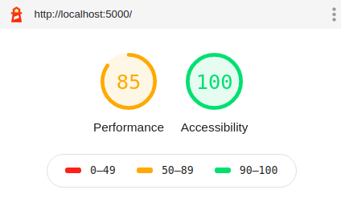

## Breweries Challenge

### Setup

- `npm install` to install dependecies
- `npm run start` to run locally

### Lighthouse Test

- `npm run build` to provide production enviroment
- `npm install -g serve` to install serve dependency
- `serve -s build`

#### Latest tests

- 

### Preamble

- I followed the instructions and didn't work more than 10 hours on this code.
